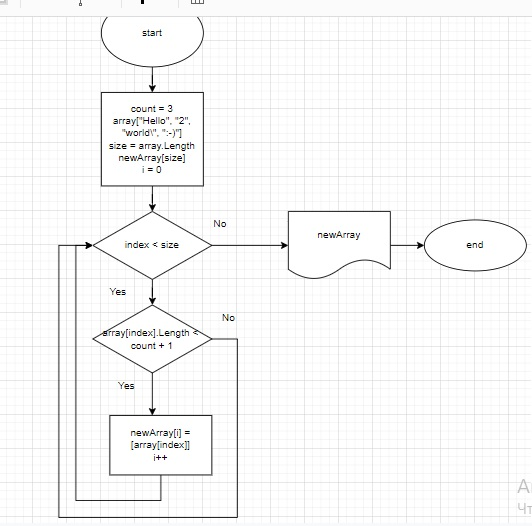

# Итоговая проверочная работа

Итоговая проверочная работа включает в себя:

* Блок-схему алгоритма - это изображение с типом файла .jpg:

* Текстовое описание проекта.

* Программу, решающую поставленную задачу.

## Решение задачи

Поставленная задача решена с использованием массивов. Идет работа со строками, каждый элемент заданного массива - это строка. Прверяем длину каждой строки и если выполняется условие, добавляем данный элемент в новый массив.